# Engineering Document Analysis – User Manual

**Disclaimer**:
This document only covers usage instructions.
For installation, setup, and environment configuration, please refer to the README.md file.

## Introduction

This guide explains how to use the Engineering Document Analysis web interface. It covers the available tabs, uploading files, tracking progress, editing extracted data, and managing your report history.

## Interface Overview

Tabs

- Advanced Design Criteria: Upload documents, run AI-powered extraction, and generate reports.
- History: View, search, download, or delete past reports.

## Step by Step workflow walkthrough

### Step 1: Landing Page

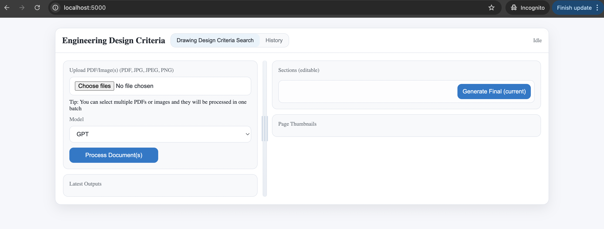

When you first open the application in your browser (http://localhost:5000 by default), you will be directed to the Engineering Design Criteria landing page.

On the left panel, you will see the Upload and Model Selection area:

- Choose Files: Upload one or more PDF or image files (.pdf, .jpg, .jpeg, .png). Multiple files can be selected for batch processing.

- Model: The models that are supported for the purpose of extraction of the key criteria.

- Process Document(s): Once files are chosen and the model is selected, click this button to begin processing.

On the right panel, placeholders are displayed for:

- Sections (editable): Where extracted design criteria will appear for review and editing.

- Page Thumbnails: Where thumbnail previews of document pages will be shown after processing. This will include the images of each pages from the original document.

At this stage, no files have been uploaded, so the interface appears empty and idle.

### Step 2: Selecting the files

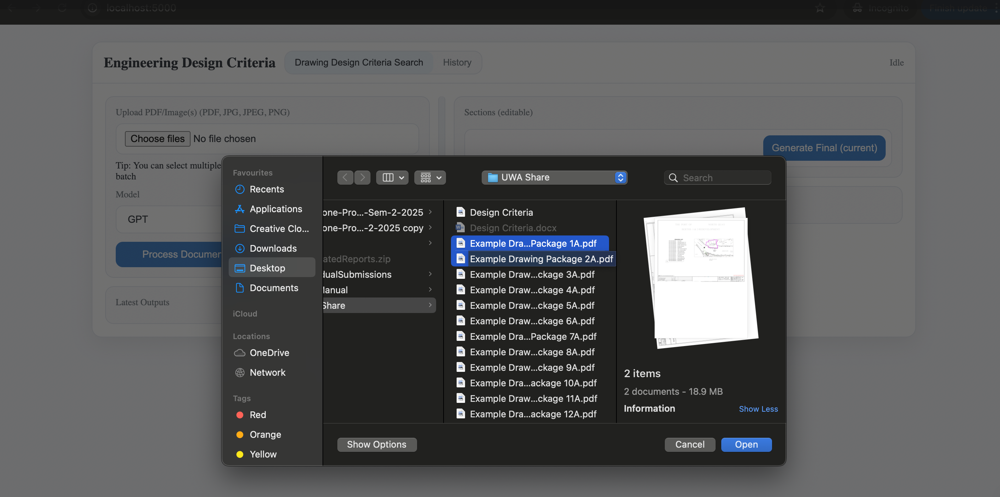

Click the Choose Files button to open your file browser. From here, select the engineering drawing(s) or document(s) you want to analyze.

- Supported file formats include PDF, JPG, JPEG, and PNG.

- You can select a single file (for example, one drawing package) or multiple files at once. When multiple files are selected, they will be processed together as a batch.

- Batch uploads are especially useful when working with a set of related engineering drawings, such as multiple drawing packages in a project.

Once you have selected the files, click Open in your file browser to confirm your selection. The chosen files will now be ready for processing in the application.

### Step 3: Choosing the AI Model

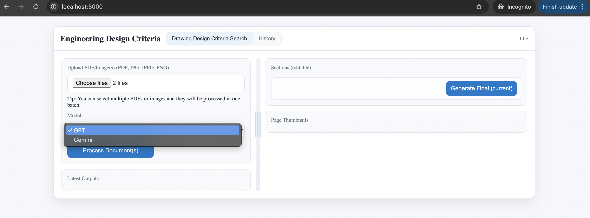

After selecting your file(s), choose which AI model you would like to use for analysis.

- GPT – Uses the OpenAI GPT-4 model for extracting and structuring design criteria.

- Gemini – Uses the Google Gemini 2.5 pro model for extraction and analysis.

Select your preferred model from the dropdown menu. The chosen model will be used to process all uploaded documents in the batch.

**Please note that you will need to set up your environment variables correctly as README.md described in order to choose the respective models**

### Step 4: Processing Documents

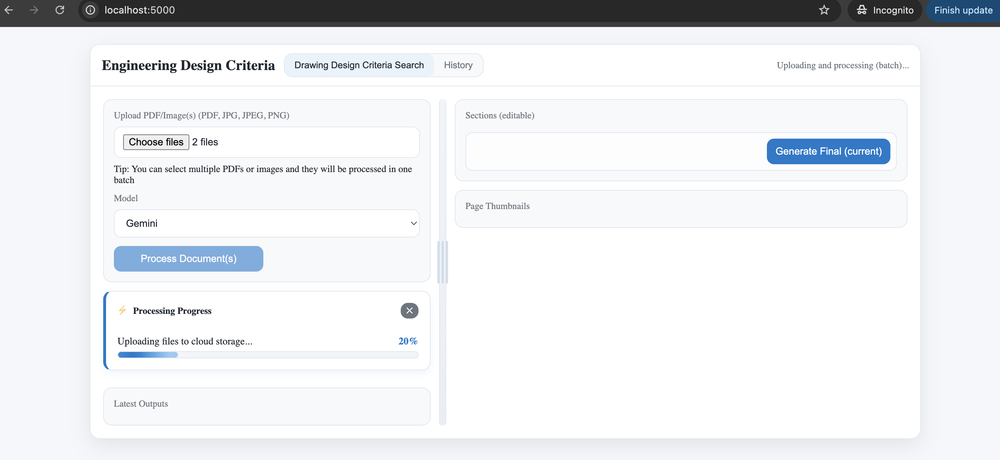

Once you have selected the model, click the “Process Document(s)” button to begin.

- All uploaded files (PDFs and/or images) will be processed together in one batch.

- A progress bar will appear, showing the current stage of processing (e.g., uploading, OCR extraction, AI analysis).

- The percentage indicator updates in real time so you can track the progress until completion.

Do not close the page while processing is underway if you wish to edit, otherwise, you can close the tab and view your report in the history afterwards.

### Step 5: Viewing Initial Results

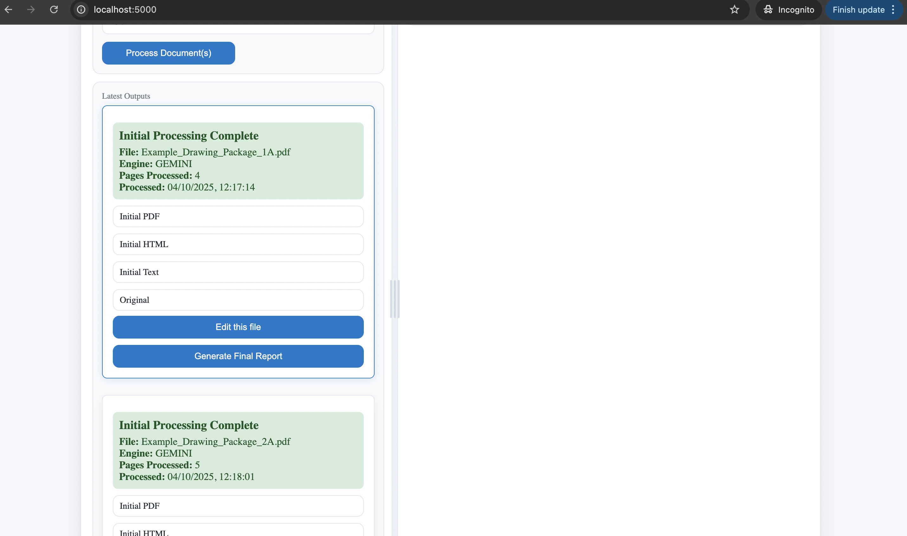

Once the processing is complete, the results for each uploaded file will be displayed under Latest outputs.

- Each processed document shows a summary including:

    - File name

    - Engine used (GPT-4 or Gemini 1.5)

    - Number of pages processed

    - Timestamp of completion

- Alongside the summary, you will see links to the generated outputs:

    - Initial PDF – PDF file containing extracted text.

    - Initial HTML – Web-based report view.

    - Initial Text – Raw text file of the extracted criteria.

    - Original – A link to the original uploaded file.

You can also choose to:

- Edit this file – Review and refine the extracted design criteria before finalizing.

- Generate Final Report – Create a polished report (PDF, HTML, or Text) incorporating your edits.

### Step 6: Editing the Extracted Content

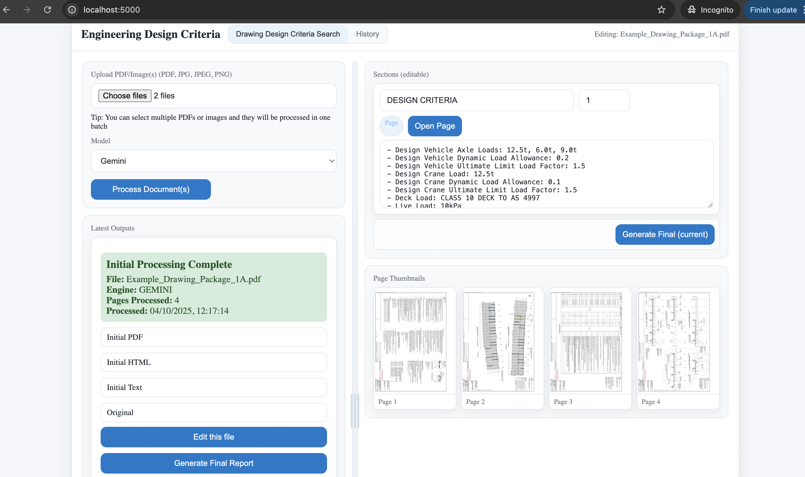

When you choose to **Edit this file**, the interface updates to display the extracted content in an editable view.

On the right-hand side of the screen you will see:

- Sections (editable):
The extracted design criteria are shown in a text area where you can directly modify, correct, or add details. Each section is labeled and linked to the corresponding page number.

- Page Thumbnails:
Below the editable text, thumbnails of the document pages are displayed. These provide a quick visual reference, allowing you to check the original context of the extracted information. Clicking a thumbnail will open the corresponding page.

- Generate Final (current) Button:
Once you are satisfied with your edits, you can click this button to create the final version of the report (PDF, HTML, or Text).

This view allows you to refine the AI-extracted criteria before generating your polished final report.

### Step 7: Side-by-Side Review

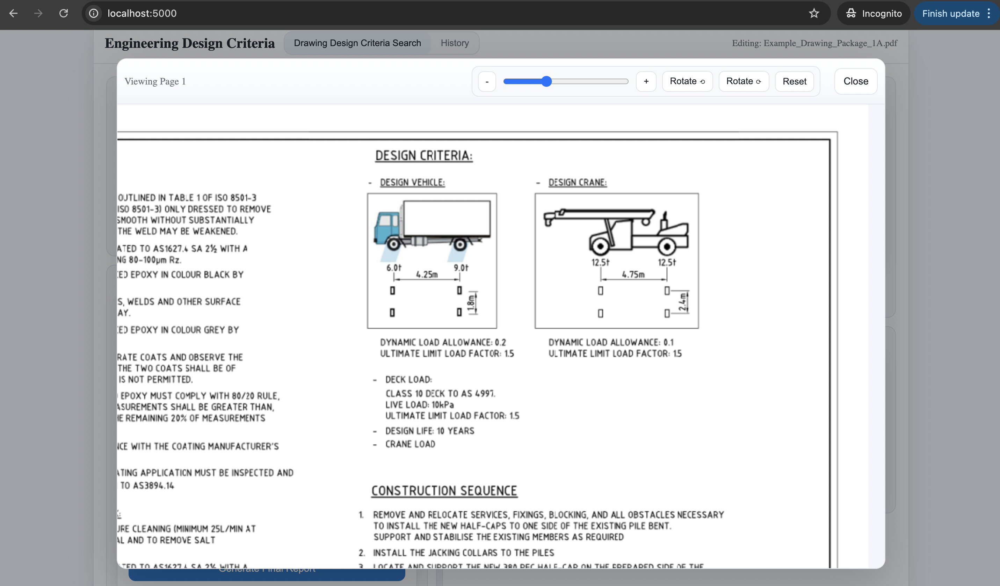

You can open the original document page to compare extracted values with the source material. This view displays the image of the page where the extracted values are retrieved. For example, if the section extracts the details from page number 3 of the original document, clicking "Open Page" for that section would give you back only page number 3 of the original document.

The page viewer includes controls for zooming in/out, rotating, and resetting the page to make it easier to read details.

This feature ensures accuracy by letting you directly validate AI-extracted content against the original document before finalizing. It gives you confidence that the report reflects the correct design criteria and allows adjustments if needed.

### Step 8: Generate Final Report

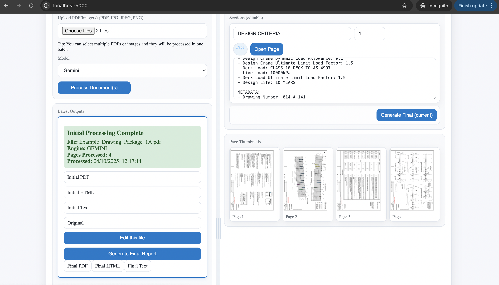

Once you are satisfied with the edits in the editable section, click the Generate Final Report button.

After generation is complete, three download options appear beneath the file entry:

- Final PDF – Download the polished report in PDF format.

- Final HTML – Export the report as an HTML document.

- Final Text – Export the report as plain text.

This step finalizes the AI-extracted and user-refined content into a usable, shareable format.

### Step 9: View the Final Report

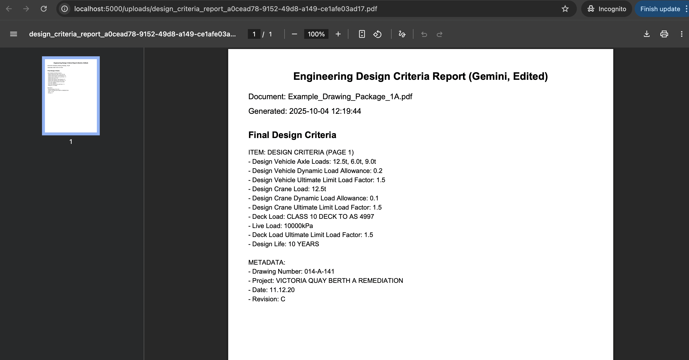

After generating the final report, select one of the available output formats — PDF, HTML, or Text — to open and review the completed document.

The report includes the document name, generation time, extracted and refined design criteria, and any metadata such as drawing numbers or project details.

This example shows the PDF output, which presents the final design criteria in a clean, formatted report suitable for review, sharing, or record-keeping.

### Step 10: View Report History

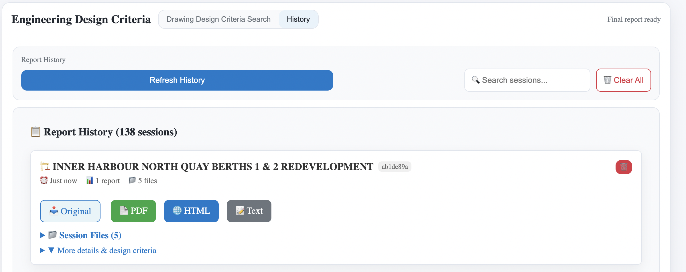

After generating reports, you can review all past processing sessions in the “History” tab located at the top of the interface.

Each history entry represents a single session, which corresponds to one batch of documents processed together.
For each session, the interface displays:

- The project or drawing title automatically derived from the document content

- The number of reports and files included in that session

- Download options for the final report in PDF, HTML, or Text format

- “Session Files” dropdown to review associated uploads and extracted details

You can also use the search bar to locate specific sessions or click “Clear All” to remove all saved histories.

### Step 11: View Detailed Session Information

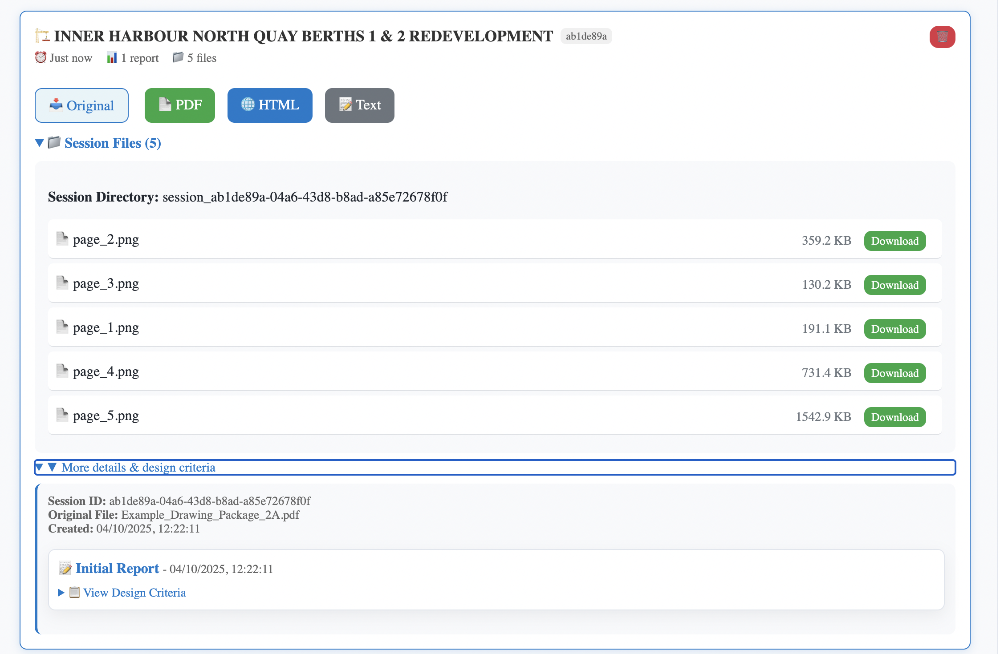

By expanding a session in the History tab, you can access detailed information about that specific processing batch.

Each session displays:

- The Session ID (a unique identifier for tracking)

- The original uploaded file name

- The creation date and time of the session

- A list of generated page thumbnails (PNG files) — these are visual previews extracted from the uploaded documents

- The initial report and its extracted design criteria

These files (page previews, reports, and extracted data) are stored locally in your project’s /uploads directory.
If they are accidentally deleted from local storage, the associated session details will no longer be viewable in the web interface.

## Notes

### 1. API Keys and Model Reliability

The application relies on external AI services (Google Gemini 2.5 Pro or OpenAI GPT-4o) for text extraction and interpretation.

Occasionally, requests may fail or time out due to service unavailability, expired API keys, or network issues.

If you see unexpected errors or the progress bar stops updating, please check that:

- Your internet connection is stable.

- Re-running the same file after a short wait often resolves temporary API-related issues.

### 2. File Size and Processing Limits

Extremely large files can cause processing to fail or stall.

It is recommended to:

- Split very large documents into smaller batches.

- Compress images before uploading.

- Monitor the progress bar — if it remains idle for a long period, refresh and try again with fewer files.

Processing time may vary depending on the file size and model selected.

- Typical duration: around 1–2 minutes per standard engineering document (5–6 pages).

- Heavily scanned or image-heavy files may take longer.

### 3. OCR and AI-Generated Content Accuracy

The system uses Google Cloud Vision OCR to read and digitize drawings and tables.

OCR output quality may vary depending on:

- The document’s scan quality, background color, and text contrast.

- Distortion or rotation in scanned pages.

While the AI models (Gemini/GPT) interpret and extract structured criteria automatically, some extracted text or numerical values may be inaccurate, incomplete, or misinterpreted.

Always review and verify extracted data manually — especially when dealing with critical engineering values or specifications.

