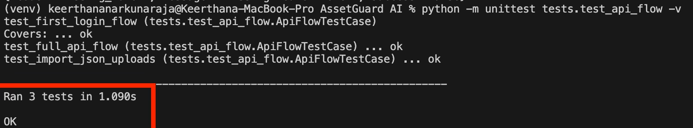
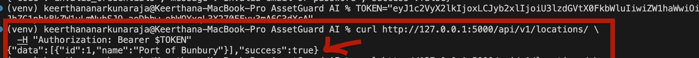
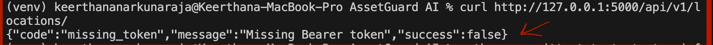

# Issue 16 – Login and Authentication Flow Validation

## Tester
Keerthana Narkunaraja 

## Branch
testing/issue-16-login-auth-validation

## Environment
Local Flask backend (AssetGuard AI), seeded database, macOS terminal

## Test Cases Executed

- Valid login with System_Admin
- Valid login with Asset_Manager
- Valid login with Contractors
- Invalid login with incorrect password
- Access protected endpoint with valid token
- Access protected endpoint without token
- Execution of automated backend tests

## Results

- All valid login requests returned authentication tokens successfully
- Invalid login attempt was rejected with appropriate error message
- Protected endpoint allowed access with valid token
- Protected endpoint denied access without token
- Automated tests executed successfully

## Status
All test cases passed successfully

## Evidence

- Screenshot 1: Execution of automated backend tests using unittest, confirming all test cases passed successfully 

- Screenshot 2: Authenticated API request demonstrating successful access to protected resources using a valid Bearer token 

- Screenshot 3: Unauthorized API request without a token, confirming access control enforcement through appropriate error handling
 