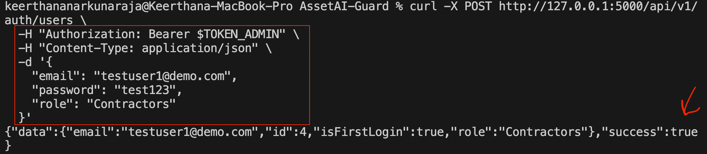
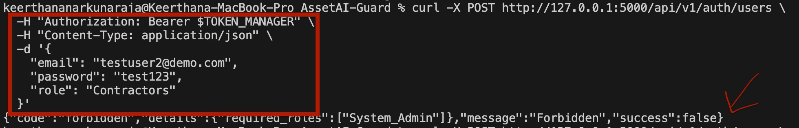
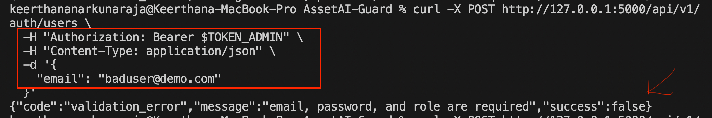
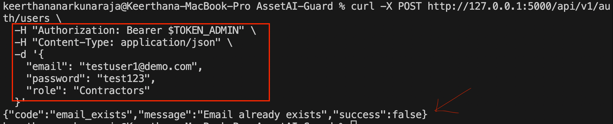

# Issue 17 – Admin CRUD Functionality Validation

## Tester
Keerthana Narkunaraja 

## Branch
testing/issue-17-admin-crud-validation

## Environment
Local Flask backend (AssetGuard AI), seeded database, macOS terminal

---

## Test Cases Executed

- Admin creates a new user (valid input)
- Manager attempts to create a user (permission restriction)
- Admin creates user with missing fields (validation test)
- Admin attempts to create duplicate user

---

## Results

- Admin successfully created a new user with valid input
- Manager was correctly restricted from performing admin-only operations
- Requests with missing required fields were rejected with validation errors
- Duplicate user creation was handled correctly by the system

---

## Status
All test cases passed successfully

---

## Evidence

### Screenshot 1: Admin Successfully Creates User

### Screenshot 2: Manager Attempt to Create User (Permission Denied)

### Screenshot 3: Validation Error (Missing Fields)

### Screenshot 4: Duplicate User Error
