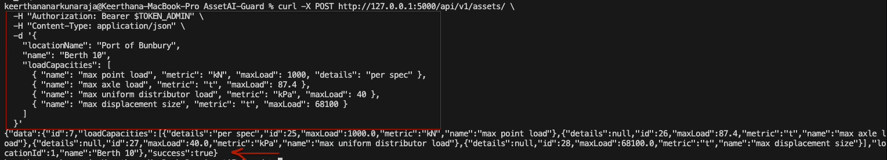
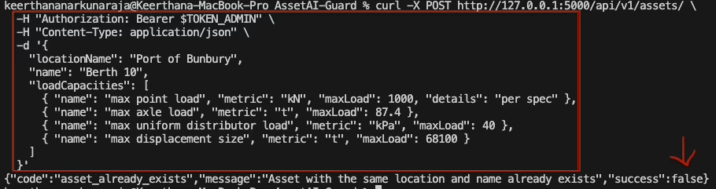
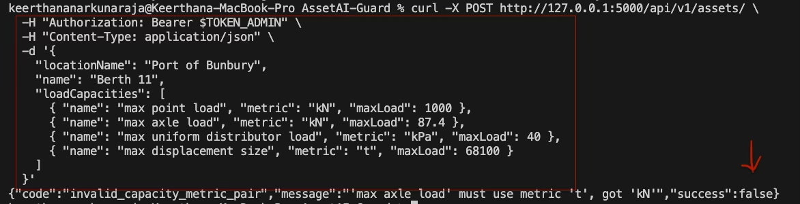
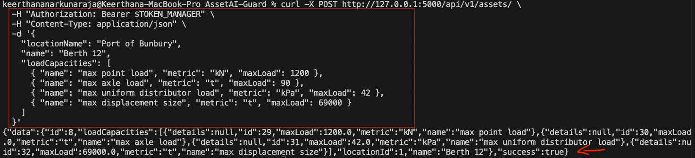
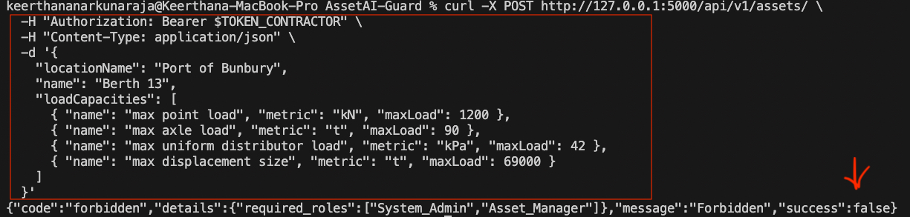

# Issue 18 – Asset Management Module Validation

## Tester
Keerthana Narkunaraja

## Branch
testing/issue-18-asset-management-validation

## Environment
Local Flask backend (AssetGuard AI), seeded database, macOS terminal

---

## Test Cases Executed

- Admin creates a valid asset
- Admin attempts to create duplicate asset
- Admin submits invalid capacity name/metric pair
- Manager creates a valid asset
- Contractor attempts to create an asset without permission

---

## Results

- Admin successfully created a valid asset with correct load capacities
- Duplicate asset creation was correctly rejected by the system
- Invalid capacity metric pairing was correctly rejected with validation error
- Manager was able to create a valid asset as expected
- Contractor was correctly restricted from creating assets

---

## Status
All test cases passed successfully

---

## Evidence

### Screenshot 1: Admin Successfully Creates Valid Asset

### Screenshot 2: Duplicate Asset Rejected

### Screenshot 3: Invalid Capacity Metric Pair Rejected

### Screenshot 4: Manager Successfully Creates Asset

### Screenshot 5: Contractor Permission Denied
