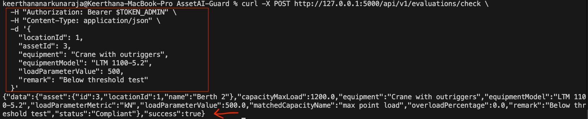
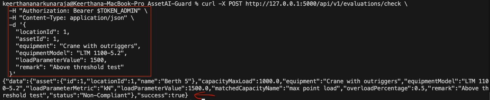
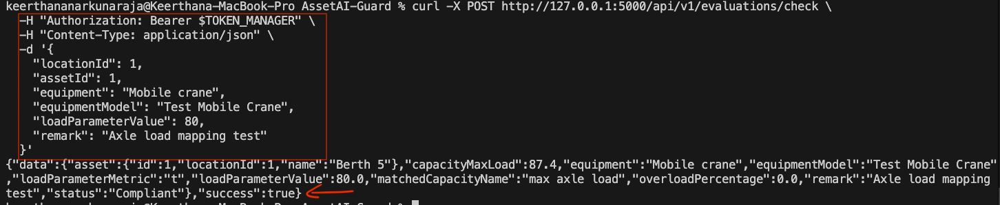
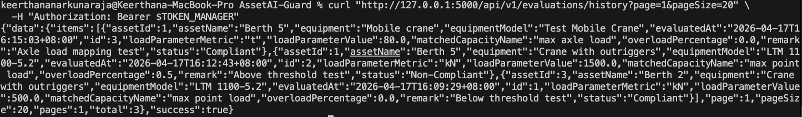
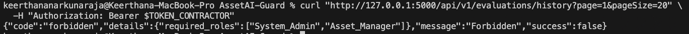

# Issue 19 – Evaluation Logic and Compliance Decision Validation

## Tester
Keerthana

## Branch
testing/issue-19-evaluation-logic-validation

## Environment
Local Flask backend (AssetGuard AI), seeded database, macOS terminal

---

## Test Cases Executed

- Valid evaluation below threshold
- Valid evaluation above threshold
- Equipment mapping validation using alternate equipment type
- Evaluation history access as manager
- Evaluation history access restriction for contractor

---

## Results

- The system successfully processed a valid evaluation request below the threshold
- The system correctly returned a non-compliant result for a value above the threshold
- Equipment-to-capacity mapping was applied correctly during evaluation
- Evaluation history was accessible to authorized roles
- Unauthorized roles were correctly denied access to evaluation history

---

## Status
All test cases passed successfully

---

## Evidence

### Screenshot 1: Valid Evaluation Below Threshold

### Screenshot 2: Non-Compliant Evaluation Above Threshold

### Screenshot 3: Equipment Mapping Validation

### Screenshot 4: Manager Access to Evaluation History

### Screenshot 5: Contractor Denied Evaluation History Access
