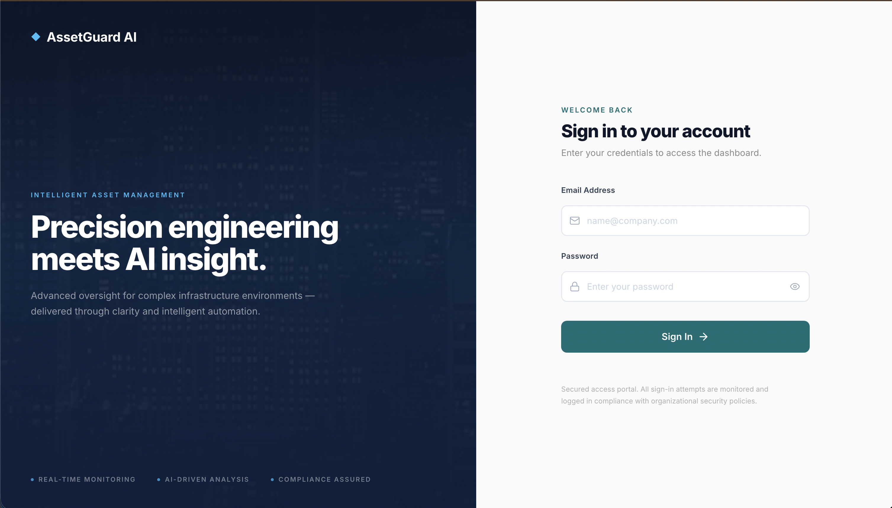
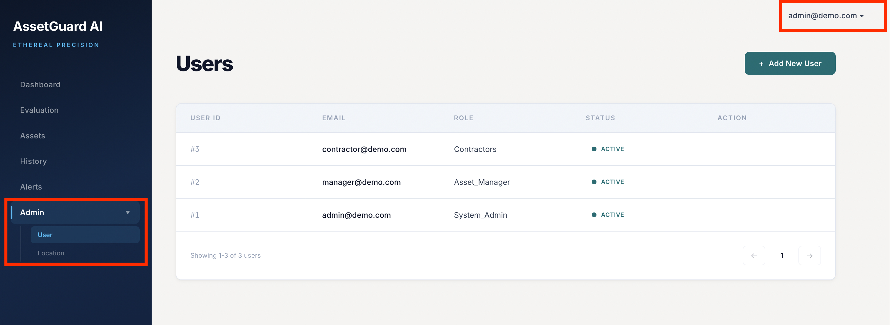
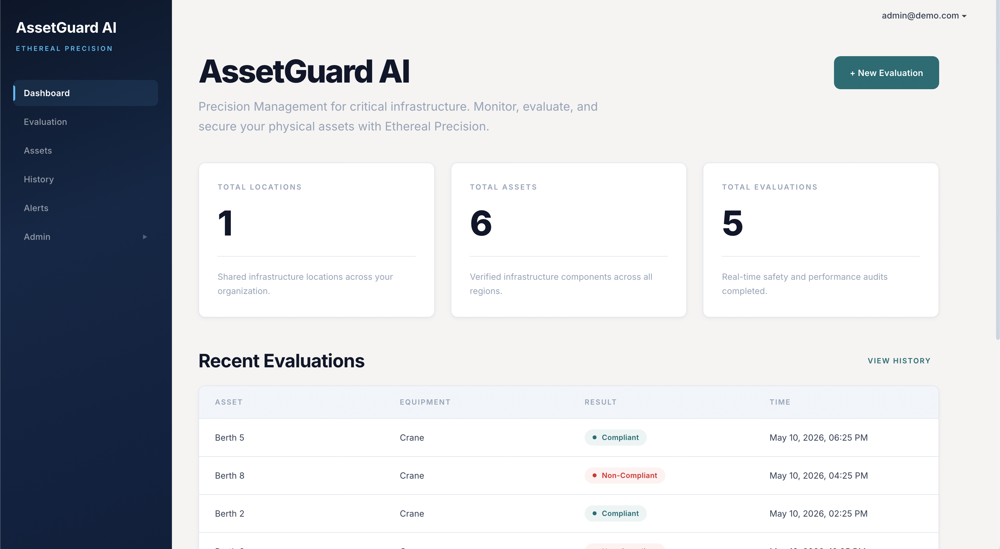
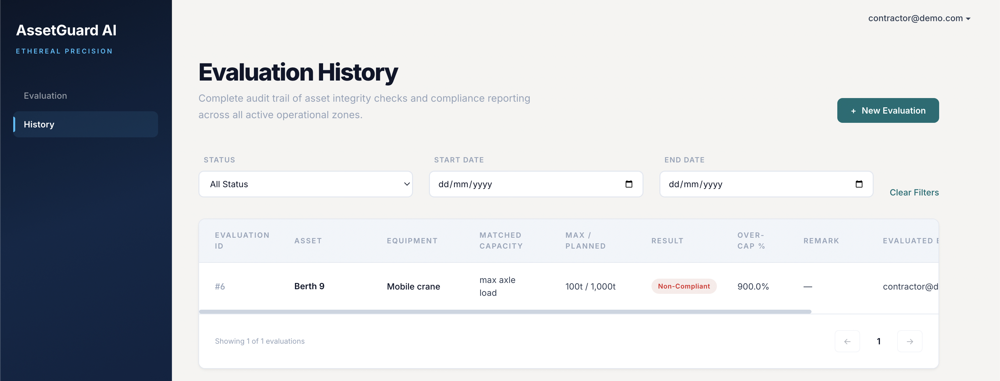
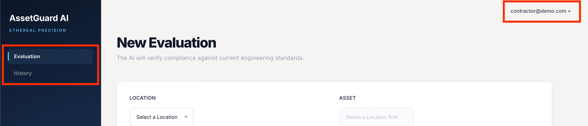

# Issue 20 – Dashboard Data Rendering and Navigation Validation

## Tester
Keerthana Narkunaraja 

## Branch
testing/issue-20-dashboard-validation

## Environment
Local frontend and backend environment using AssetGuard AI Flask backend and assetguard-ui frontend.

---

## Test Cases Executed

- Login page rendering validation
- Dashboard page load validation
- Dashboard data/table rendering validation
- Navigation between available dashboard pages
- Contractor evaluation history visibility
- Role-based dashboard access validation

---

## Results

- Login page loaded successfully without visible layout errors.
- Dashboard loaded successfully after valid authentication.
- Dashboard data and tables rendered correctly.
- Navigation between available pages worked as expected.
- Contractor evaluation history was visible after the latest frontend update.
- Role-based access behaved as expected for available user roles.

---

## Status

All available dashboard rendering and navigation test cases passed successfully.

---

## Evidence

### Screenshot 1: Login Page Rendered Successfully

### Screenshot 2: Dashboard Loaded Successfully

### Screenshot 3: Navigation Validation

### Screenshot 4: Contractor Evaluation History

### Screenshot 5: Role-Based Access
