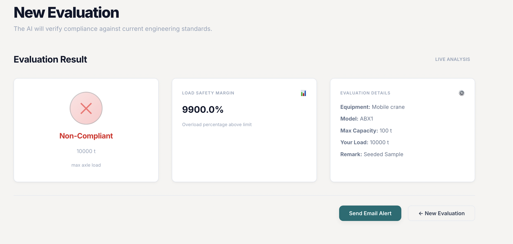
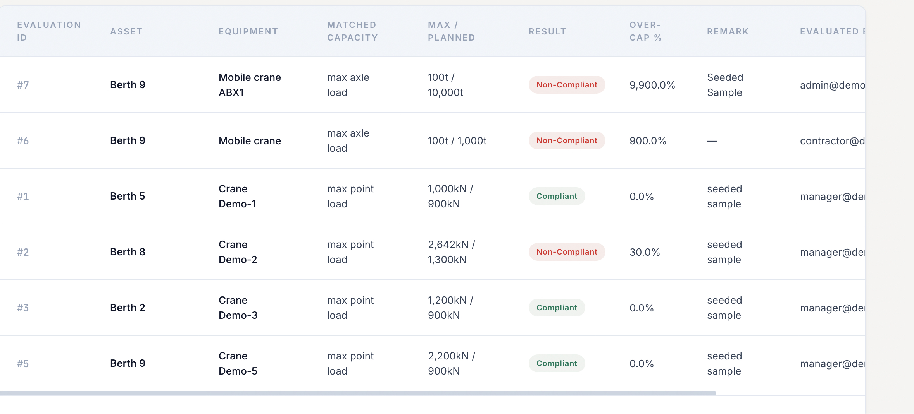
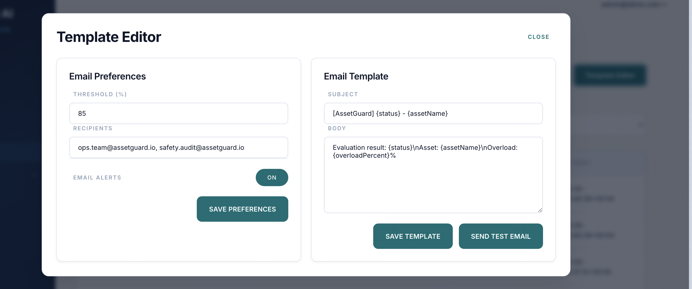

# Issue 21 – Email Notification and Alert Workflow Validation

## Tester
Keerthana Narkunaraja

## Branch
testing/issue-21-email-alert-validation

## Environment
Local frontend and backend environment using AssetGuard AI Flask backend and assetguard-ui frontend.

---

## Test Cases Executed

- Non-compliant evaluation trigger validation
- Alert/result behaviour validation after failed compliance check
- Email notification workflow availability check

---

## Results

- Non-compliant evaluation scenario was tested successfully.
- The system returned/displayed the expected non-compliant result.
- Full outbound email delivery could not be validated because the email and alert workflow is not currently configured/available for testing.
- The feature should be retested once email notification integration is completed.

---

## Status

Partially validated – non-compliant workflow tested, email delivery pending integration/configuration.

---

## Evidence

### Screenshot 1: Non-Compliant Evaluation Trigger

### Screenshot 2: Alert or Non-Compliant Result

### Screenshot 3: Email Workflow Pending/Not Available
